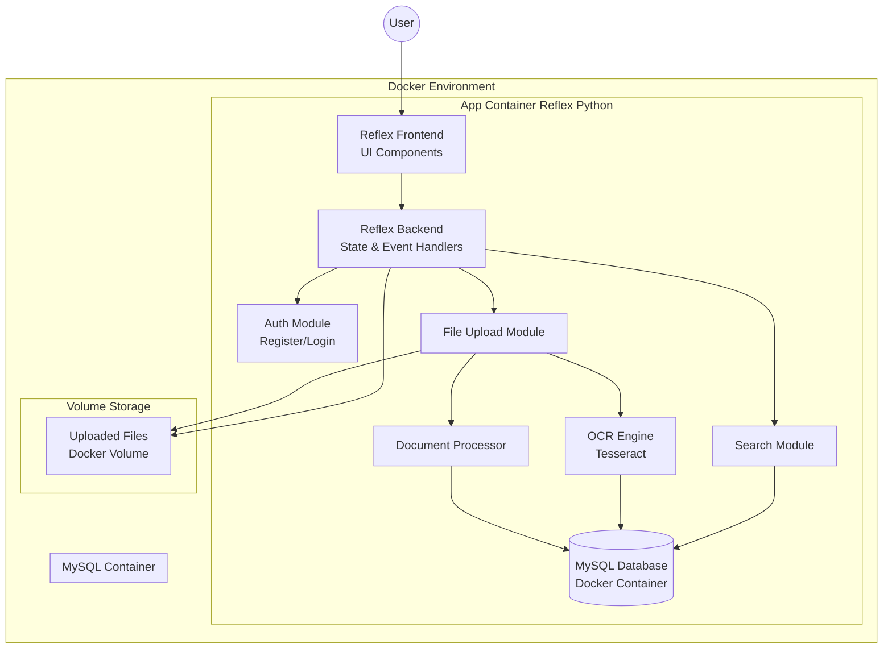
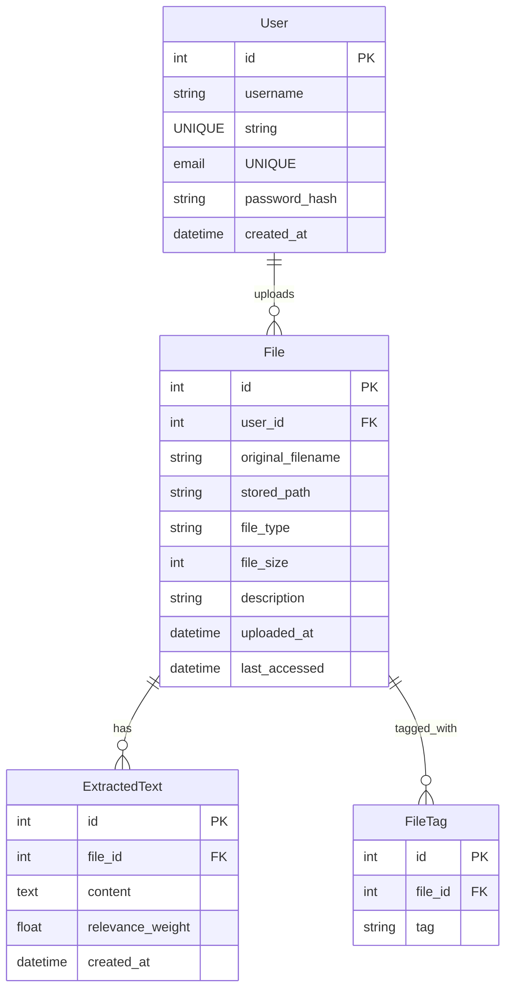
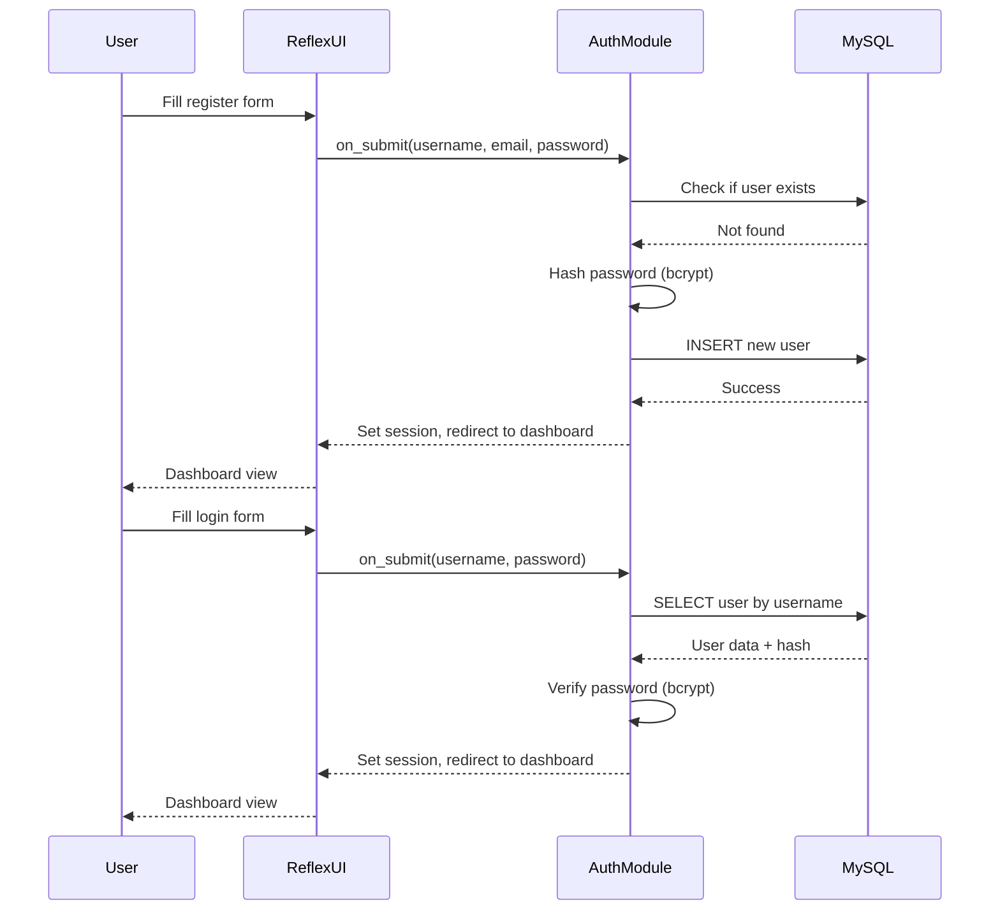
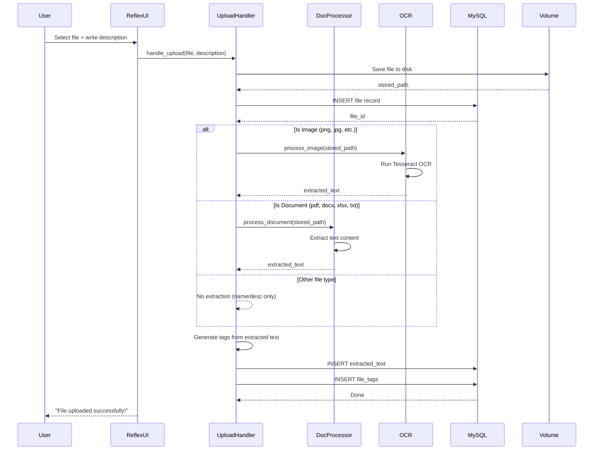
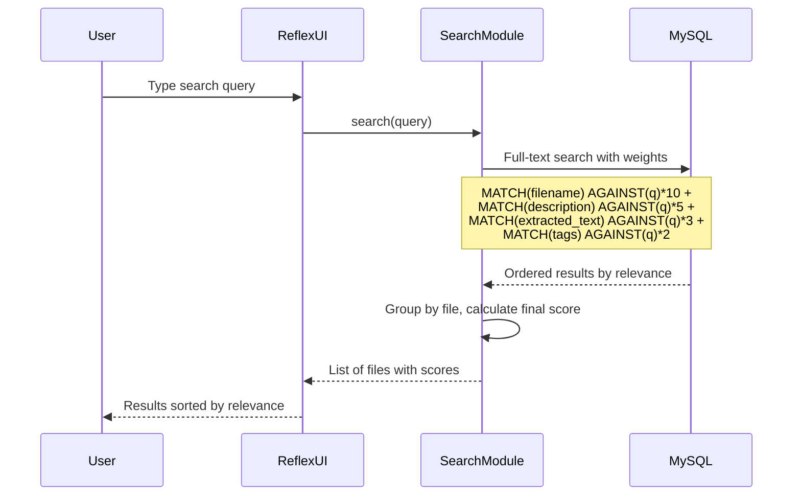

# 📁 ReQperacion - Architecture Plan

## Overview

A Google Drive-like platform for file upload, document processing (OCR/text extraction), and full-text search. Built with **Reflex (Python)**, **MySQL**, and **Docker**. Project name: **ReQperacion**.

---

## 1. Technology Stack

| Component | Technology | Justification |
|-----------|-----------|---------------|
| **Frontend + Backend** | [Reflex](https://reflex.dev) (Python) | Full-stack Python, rapid development, built-in state management, user already knows it |
| **Database** | MySQL 8.0 | Required by user, reliable, full-text search support |
| **OCR** | Tesseract OCR (via `pytesseract`) | Free, open-source, local, works with images |
| **Document Processing** | `python-docx` (Word), `openpyxl` (Excel), `PyMuPDF` (PDF), `textract` (TXT) | All free, local, no cloud dependencies |
| **File Storage** | Docker volume (local filesystem) | Simple, persistent, no cloud |
| **Containerization** | Docker + Docker Compose | Required by user |
| **Authentication** | Reflex built-in sessions + bcrypt | Simple, sufficient for a university project |

---

## 2. Architecture Diagram



---

## 3. Database Schema



### SQL Details

- **Users table**: Stores credentials with bcrypt-hashed passwords
- **Files table**: Tracks metadata (name, type, size, description, path on disk)
- **ExtractedText table**: Stores OCR/text extraction output per file; used for full-text search
- **FileTags table**: Auto-generated tags from extracted content (keywords) to improve search precision

### Search Relevance Strategy

The search will use a **weighted scoring system**:

| Field | Weight | Reason |
|-------|--------|--------|
| `files.original_filename` | 10x | Name match = most relevant |
| `files.description` | 5x | User description = high relevance |
| `extracted_text.content` | 3x | Document body = medium relevance |
| `file_tags.tag` | 2x | Auto-tags = supporting signal |

MySQL `FULLTEXT` indexes will be used on `original_filename`, `description`, and `extracted_text.content` with `MATCH...AGAINST` in boolean mode for relevance scoring.

---

## 4. Authentication Flow



---

## 5. File Upload & Processing Pipeline



### Supported File Types & Processing

| File Type | Extension | Processor | Library |
|-----------|-----------|-----------|---------|
| Image | `.png`, `.jpg`, `.jpeg`, `.bmp`, `.tiff` | OCR | `pytesseract` + `Pillow` |
| PDF | `.pdf` | Text extraction | `PyMuPDF` (fitz) |
| Word | `.docx` | Text extraction | `python-docx` |
| Excel | `.xlsx` | Text extraction | `openpyxl` |
| Plain Text | `.txt` | Direct read | Built-in |
| Other | Any | No extraction | - |

---

## 6. Search Flow



---

## 7. UI/UX Design (Pastel Blue Theme)

### Color Palette

| Role | Color | Hex |
|------|-------|-----|
| Background | White | `#FFFFFF` |
| Card/Surface | Very light gray-blue | `#F0F4F8` |
| Primary accent | Pastel blue | `#A8D5E2` |
| Primary hover | Slightly darker pastel blue | `#8BC4D4` |
| Secondary accent | Soft blue | `#B8D4E8` |
| Text primary | Dark gray | `#2D3748` |
| Text secondary | Medium gray | `#718096` |
| Success | Soft green | `#9AE6B4` |
| Error | Soft red | `#FEB2B2` |

### Page Structure

1. **Login/Register Page** (combined layout)
   - Centered card with pastel blue border
   - **Left side**: Login form (username, password, "Sign In" button)
   - **Right side**: Register form (username, email, password, confirm password, "Sign Up" button)
   - **Divider**: Vertical line or subtle separator between both sides
   - Project logo/name "ReQperacion" at the top of the card
   - Clean form fields with pastel blue focus rings

2. **Dashboard (File List)**
   - Top navbar with app name + user avatar + logout
   - Search bar (prominent, centered)
   - "Upload" button (pastel blue, rounded)
   - File grid/list view with cards showing:
     - File icon (by type)
     - Filename
     - Description (truncated)
     - Upload date
     - Size
   - Click file → detail view / download

3. **Upload Modal**
   - Drag-and-drop zone (dashed border, pastel blue)
   - File input
   - Description textarea
   - Submit button

4. **File Detail View**
   - Full file info
   - Extracted text preview
   - Tags displayed as chips
   - Download button

---

## 8. Docker Setup

```yaml
# docker-compose.yml structure
services:
  mysql:
    image: mysql:8.0
    environment:
      MYSQL_ROOT_PASSWORD: ...
      MYSQL_DATABASE: clouddrive
    volumes:
      - mysql_data:/var/lib/mysql
    ports:
      - "3306:3306"

  app:
    build: .
    ports:
      - "3000:3000"  # Reflex default
    volumes:
      - ./app:/app
      - uploads:/app/uploads
    depends_on:
      - mysql
    environment:
      DATABASE_URL: mysql://...
```

---

## 9. Project Structure

```
reqperacion/
├── docker-compose.yml
├── Dockerfile
├── requirements.txt
├── app/
│   ├── __init__.py
│   ├── app.py              # Reflex app entry point
│   ├── models.py            # Database models (SQLAlchemy)
│   ├── auth.py              # Authentication logic
│   ├── upload.py            # File upload handler
│   ├── processor.py         # Document text extraction
│   ├── ocr.py               # OCR processing
│   ├── search.py            # Search logic
│   ├── tags.py              # Tag generation
│   ├── pages/
│   │   ├── __init__.py
│   │   ├── login.py         # Combined Login/Register page
│   │   ├── dashboard.py     # Main dashboard
│   │   ├── upload.py        # Upload modal
│   │   └── file_detail.py   # File detail view
│   ├── components/
│   │   ├── __init__.py
│   │   ├── navbar.py        # Navigation bar
│   │   ├── file_card.py     # File card component
│   │   └── search_bar.py    # Search bar component
│   ├── styles/
│   │   ├── __init__.py
│   │   └── theme.py         # Pastel blue theme config
│   └── utils/
│       ├── __init__.py
│       └── helpers.py       # Utility functions
├── uploads/                 # Uploaded files (Docker volume)
└── mysql/                   # MySQL data (Docker volume)
```

---

## 10. Implementation Steps (Todo List)

### Phase 1: Project Setup
1. Initialize Reflex project structure
2. Create Dockerfile and docker-compose.yml
3. Set up MySQL connection with SQLAlchemy
4. Create database models (User, File, ExtractedText, FileTag)

### Phase 2: Authentication
5. Implement registration page (username, email, password)
6. Implement login page with session management
7. Add logout functionality
8. Protect routes (redirect to login if not authenticated)

### Phase 3: File Management
9. Implement file upload with description
10. Create file listing dashboard (grid view)
11. Implement file download
12. Create file detail view

### Phase 4: Document Processing
13. Implement PDF text extraction (PyMuPDF)
14. Implement Word document extraction (python-docx)
15. Implement Excel extraction (openpyxl)
16. Implement TXT extraction
17. Implement OCR for images (pytesseract + Pillow)

### Phase 5: Search
18. Create MySQL FULLTEXT indexes
19. Implement weighted search query
20. Build search UI with results display
21. Auto-generate tags from extracted content

### Phase 6: UI Polish
22. Apply pastel blue theme globally
23. Add responsive design
24. Add loading states and animations
25. Add file type icons
26. Polish upload modal with drag-and-drop

### Phase 7: Docker & Final
27. Test full Docker Compose setup
28. Add .dockerignore and .gitignore
29. Final testing and documentation
